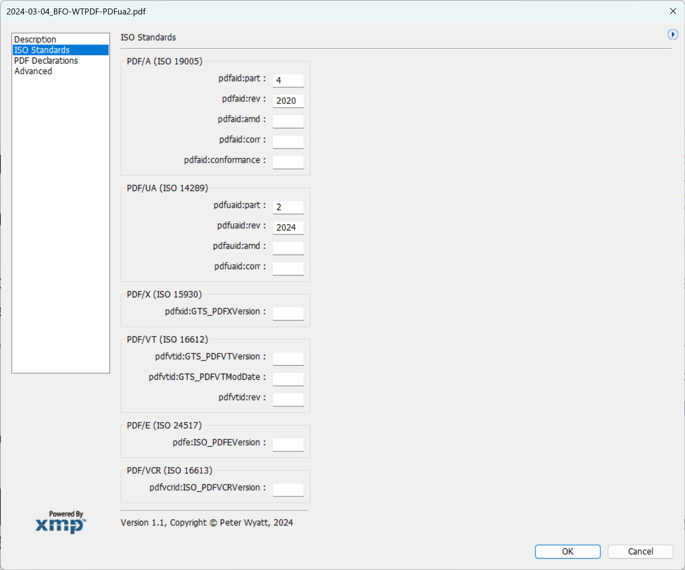
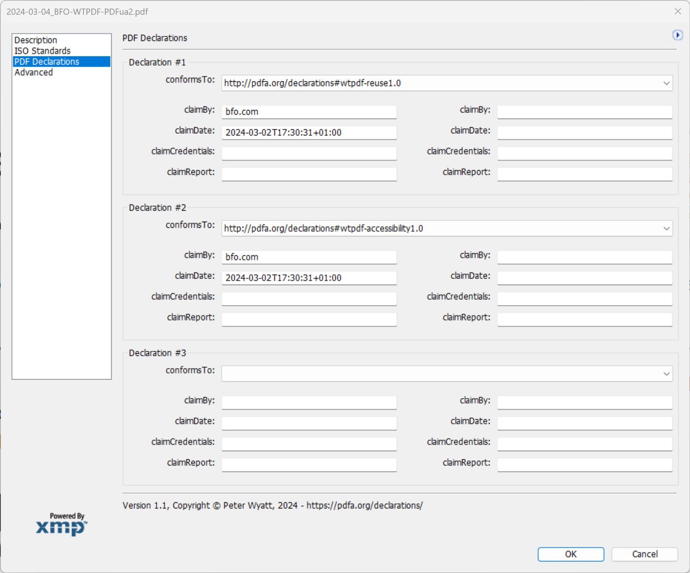

# Acrobat Custom File Info Panels
Custom File Info Panels for Adobe Acrobat that provide a nice display of XMP metadata information (note: the XMP data is **not** editable via these displays according to Adobe documentation). The format for these custom file info panels is poorly documented in Adobe's "XMP Custom Panels", dated October 2003, which I can no longer find on the Adobe website but which still works in Acrobat. Here is [a link to the documentation](http://metadatadeluxe.pbworks.com/f/XMP_CustomPanels.pdf).

Copy these files to the following locations (_note that these folders may need to be created first_) - the file extension does not matter:

Mac OS X:
- `{Root Volume}/Library/Application Support/Adobe/XMP/Custom File Info Panels` - for all users on the machine
- `{Home Directory}/Library/Application Support/Adobe/XMP/Custom File Info Panels` - for each user

Windows:
- `C:\Program Files\Common Files\Adobe\XMP\Custom File Info Panels` - for all users on the machine
- `C:\Documents and Settings\<user>\Application Data\Adobe\XMP\Custom File Info Panels` - for each user

To access:
- menu option `File` | `Document Properties...`
- click the `Additional Metadata...` button on the first "Description" tab
- a new dialog will open and the list on the left will show all additional panels

Example PDFs with both ISO conformance levels and PDF Declarations are available from [https://pdfa.org/wtpdf/](https://pdfa.org/wtpdf/).

## Debugging and Issues
Note that you can edit these files while Acrobat is running - just click the "Additional Metadata..." button on the File Properties dialog to reload all custom panels each time. As far as I know, there is no easy way to debug beyond if your panel is not listed then it has an issue.

- nested `cluster`s on Mac don't work - it appears to miscalculate the location of the contained widgets and pushes them to the far lower right corner (effectively beyond the bounds of the cluster). Only solution I came up with is not to replace nested `cluster`s with `group`!
- I've never been able to get the `picture` feature working as I don't know how to reference the asset (_file? URL? formats?_). Setting `width` and `height` does alter the size.
- I struggle to understand how to use XMP `bags` (such as needed by PDF Declarations) since it seems you can only use fixed (hard-coded) XMP paths
- I don't believe there is any way to easily comment out stuff (I normally move blocks of code to the XML portion and then use XML comments `<!-- ... -->`)
- explicit `width` and `height` don't seem portable across Windows and Mac - avoid them!
- there is an undocumented `date_edit_text` on PC but this causes an error on Mac. This normalizes the XMP date/time string to a local timezone display (so does not display precisely what is in the XMP)
- on Mac, the popup menu separator `-;` in ZStrings doesn't work and ends up being a selectable menu item

# ISO Standards
Displays the conformance data related to PDF subset ISO standards for PDF/A, PDF/UA, PDF/X, PDF/VT, PDF/E and PDF/VCR. PDF/R does not use any custom XMP metadata and is therefore not listed. Note that a single PDF document _can_ have multiple conformance levels, but a PDF can only conform to a _single_ conformance level for any specific family of PDF ISO standards as the same XMP tags are used. 

If PDF files do not use the correct namespace identifier as per the ISO standards then this dialog will **NOT** show anything (e.g. a common error is to have `pdfa:` rather than `pdfaid:` as required by ISO 19005).

Note also that the early PDF/X standards did not use XMP metadata, but only the Document Information dictionary. 

# PDF Declarations
The PDF Association defines a general extension to XMP metadata called "[PDF Declarations](https://pdfa.org/declarations)" that allows documents to declare their conformance to relevant external industry and third-party specifications such as WCAG and HIPAA. PDF Declarations use RDF `bags` of `declarations` each containing `bags` of `claimData` which is impossible (_difficult?_) to support using Custom File Info Panel fixed paths. The current dialog is limited to 3 declarations, each with 2 claims. Additional declarations or claims will not be shown.

Due to the issue with nested `cluster`s not working properly on Mac (_see above_), there are 2 different versions of this custom dialog:
1. one that uses nested `cluster`s and looks slightly better but only works on Windows [CustomPanel_PDFDeclarationsWindows.xml](CustomPanel_PDFDeclarationsWindows.xml);
2. one that only uses `group`s and works on both Mac and Windows but is slightly less intuitive [CustomPanel_PDFDeclarationsBoth.xml](CustomPanel_PDFDeclarationsBoth.xml). 

If you want to use the cluster version on Windows, then delete `CustomPanel_PDFDeclarationsBoth.xml` from whichever folder you copied the files to.

